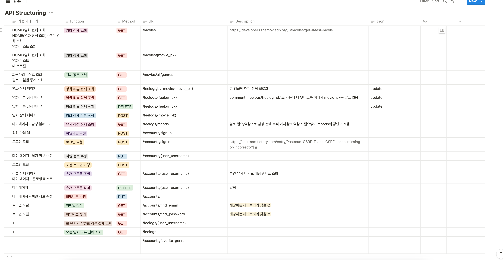
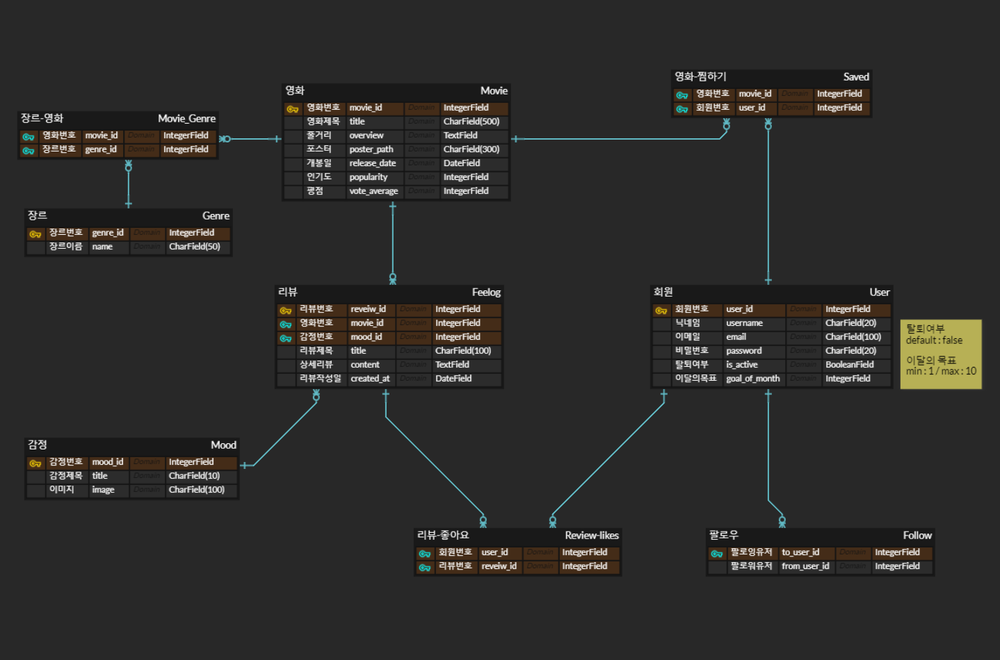

# [Project] Feel:em

## [Notion]
https://www.notion.so/Project-Feel-em-1e20a457fbdf4151bfac0cb4354742c2?pvs=4
## 🐵개요
| 개요 타이틀 | 내용 |
| --- | --- |
| 프로젝트 명 | 영화 감상평 기록을 위한 웹 서비스 Feel:em |
| 개발 인원 | 2명 |
| 개발 기간  | 5월 17일 - 5월 26일 |
| 주요 기능  | 1. 회원 가입 기능 - SNS 연동 로그인, 일반 로그인   2. 영화 기록 게시판 - CRUD 기능   3. 프로필 페이지 - CRUD 기능   4. 프로필 Follow/Unfollow 기능   5. 썸네일 메이커 - 이미지 추출 기능  |
| 개발 언어 | JavaScript ES6 / Python3 / CSS / HTML / Django 3.2.18 / Vue2.7 / node.js 18.16.0 /  |
| 배포 환경 | -  |
| DB | SQLite SDN 3 |

## 🐵업무 분담
박지영 : [Frontend] 프로젝트 계획 및 설계 주도, 전반적인 Front-end 컴포넌트 및 화면 구성, 화면 디자인과 Vue 설계, DB Serializer 설계 및 영화 추천 로직 구현, Vue 버그 및 에러 수정 
신지원 : [Backend] 전반적인 Django 백엔드 서버 구성 TMDB API를 통한 DB 데이터 추출과 저장, Front-end 파트에서 MyPage 화면 구성 담당, Django 및 DB 에러 수정, 프로젝트 발표 담당

## 🙊주제선정 
1. **누구를 위한 서비스?**
    - 자신의 `영화 취향`을 기록하고 싶은 20-30대 고객을 타겟으로 한 `영화 아카이빙 사이트`
2. **사이트 개요**
- **나의 영화 취향을 느껴보세요! → feel them! →** `Feel:em`
    - 영화 검색/영화에 대한 `Feel-log` 작성을 통해 개인의 영화 취향을 한 눈에 볼 수 있다.
- **영화 취향을 알고 싶은 유저**  : `Feelmer`
    - `Feelmer` 들은 자신들이 선호한다고 생각하는 장르 3-5개를 회원가입 시 설정한다.
    - `Feelmer` 의 취향에 맞는 색상을 설정해 프로필 페이지를 꾸밀 수 있다.
    - `Feelmer` 들의 취향 탐색을 위한 월 별 목표를 세울 수 있다.
- `Feelmer` **들의 영화 기록 :** `Feel-log`
    - `Feel-log` 에서는 한 줄 기록, 상세 기록, 명대사(선택),썸네일 메이커 기능을 사용할 수 있다.
    - 한 줄 기록 : 영화 요약 평을 작성할 수 있으며, `Feel-log` 리스트에 노출되는 페이지 
    (100자)
    - 상세 기록 : 나의 영화 감상을 상세하게 작성할 수 있다. 글자 수 제한(500자)
    - 명대사 : 네이버 영화 API를 통해 불러온 명대사를 선택하여 넣을 수 있다.
    - 썸네일 메이커 : SNS에 업로드할 수 있도록 영화 포스터, 명장면, 한 줄기록 등이 작성된 이미지를 export 할 수 있다.
- **다른** `Feelmer` **는 어떻게 생각했을까? →  프로필과 리뷰 탐색**
    - `Feelmer` 프로필을 구독하거나 영화 상세 페이지에서 다양한 `Feelmer` 의 리뷰를 감상할 수 있다.
    - 선호하는 리뷰는 좋아요를 누를 수 있고, 해당 리뷰를 작성한 `Feelmer` 를 Follow할 수 있다.

##🙉Trouble Shooting

##🙈API 설계

##🙉 Wireframe

## DB 설계

## 추천기능 구현
- 사용자가 선호하는 장르를 최대 5개까지 받아 장르를 바탕으로 데이터를 추출하고 15개 내외로 보여준다.  

## 🎬개발일지
## 2023-05-17
### 할 일 리스트

- [x]  검색 로직 생각해보기 ⇒ Vue에서 처리하기
- [x]  와이어 프레임 짜기
- [x]  API 설계 완성(시간 가능할 경우 request parameter 까지 작성한다.)
- [x]  DB not null / null 처리 하기
- [x]  깃헙 주소 생성
- [x]  readme/기본 세팅 완료 하기
- [x]  회원가입 로직 → 토큰 받는 방식으로 하기 (오전 최대한)
- [x]  리뷰 좋아요, 회원 팔로우, 영화 찜하기 기능 (model 및 나머지 구성하기)
- [x]  fixture 만들기 (data 생성)
- [x]  django 기본 셋팅 완성하기 : static 생성하기, 필수 설치 내용 requirements.txt에 정리
- [x]  DB → Accounts/followings 추가

### 내일 할 일

- [ ]  Image 에셋 찾아서 넣어놓기 ( 영상, 이미지, 이모티콘, 프로필 이미지 )
- [ ]  axios로 데이터 받아와서 뿌리는거 다 성공적인지 확인하기!
  

### 앞으로 할일

- [x]  data 가져오기 - fixture (1차로 기능 확인!)
- [x]  장고 백엔드 기본 구성 및 API fetch 테스트(21일까지 기능 완료)
- [ ]  vue 기본 기능 구현 완료
- [ ]  CSS 및 JS 활용하여 디자인 완료
- [ ]  발표 자료 준비

## 2023-05-18
### 오늘 할 일

- django 기본 셋팅 완성하기 : static 생성하기, 필수 설치 내용 requirements.txt에 정리
- model 작성하기

- [x]  fixture 만들기 (data 생성)
- [x]  django 기본 셋팅 완성하기 : static 생성하기, 필수 설치 내용 requirements.txt에 정리
- [x]  DB → Accounts/followings 추가
- [ ]  DB에 → Feelogs/review-likes 만들어야함

### 앞으로 할일

- [ ]  data 가져오기 - fixture (1차로 기능 확인!)
- [ ]  장고 백엔드 기본 구성 및 API fetch 테스트(21일까지 기능 완료)
- [ ]  vue 기본 기능 구현 완료
- [ ]  CSS 및 JS 활용하여 디자인 완료
- [ ]  발표 자료 준비
## 2023-05-19
### 오늘 할일

지원

- [x]  회원가입 로직 → 토큰 받는 방식으로 하기 (오전 최대한)
- [x]  리뷰 좋아요, 회원 팔로우, 영화 찜하기 기능 (model 및 나머지 구성하기)

지영 

- [ ]  vue에서 모듈화 하는거 배우기 (axios, 나머지 로그인 회원가입 로직들) (오전)
- [ ]  components 설계도 그려서, 가급적이면 component 요소 만들기 완성
- [ ]  모달!

### 앞으로 할일

- [ ]  Image 에셋 찾아서 넣어놓기 ( 영상, 이미지, 이모티콘, 프로필 이미지 )
- [ ]  axios로 데이터 받아와서 뿌리는거 다 성공적인지 확인하기!
## 2023-05-22
### 오늘 할일

지원

- [x]  프로필, 무드 Image 잘라서 넣어놓고, src 할당해서 이미지 링크 나오는지 확인하기
- [ ]  nav 완성, 로고 삽입
- [ ]  

지영 

- [ ]  캐롯셀 만들기
- [x]  로그인 유지(중요!!!!!!!!!!!!!!!!!!!!!!!!!!!!!!!!!!), 팔로우/찜하기/좋아요 버튼 해제 되지 않도록 수정

### 앞으로 할일

- [x]  프로필, 무드 Image 잘라서 넣어놓고, src 할당해서 이미지 링크 나오는지 확인하기
- [x]  캐롯셀 만들기
- [x]  nav 완성, 로고 삽입
- [ ]  회원가입 시 유효성 검사
- [ ]  홈 뷰에 user가 선택한 장르 무비만 나오도록 수정함
- [ ]  마이페이지에서 프로필 띄우고 이미지 띄운 뒤 클릭 → 라우팅
- [ ]  마이페이지 업데이트(회원 정보 수정),
- [ ]  필요에 따라 데이터  달리 보여주기
- [x]  로그인 유지(중요!!!!!!!!!!!!!!!!!!!!!!!!!!!!!!!!!!), 팔로우/찜하기/좋아요 버튼 해제 되지 않도록 수정
- [ ]  애니메이션 만들기(후순위)
## 2023-05-23
- [x]  **!HOTFIX** : DB에서 fixutre로 파일 받아 넣던 것 → api로 받아 바로 저장하는 방식으로 고치기 ( 2 ~ 3 )
- [x]  video 띄우기 위해서 비디오 저화질로 인코딩 하기 (?)
- [x]  Django - 인증 방식 데코레이터 붙이기 (AllowAny / IsAuthenticated)
- [x]  CSS 레이아웃 나누기 (0.5)
- [x]  Home 화면에 video 띄우기  (1)
- [ ]  리뷰카드에서 프로필 이미지 띄운 뒤 클릭하면 마이페이지로 넘어갈 수 있도록 하기.  (0.5)
- [ ]  마이페이지 회원정보 수정하는 기능 넣기 (1)
- [ ]  Home 화면에 보여줄 데이터 수정하기( 포스터 : poster, title만, 리뷰카드 : feelog, nickname만)
- [ ]  MyPage 화면에 보여줄 데이터 수정하기 (프로필 이미지, 닉네임, 찜한 영화, 팔로워목록 및 목표)

— 나중에 — 

- [ ]  회원가입 시 유효성 검사하는 것 추가하기 (0.7)
- [ ]  좋아요 클릭시 reload 하면 좋아요가 해제되는 문제 해결 (0.5)
- [ ]  팔로우 클릭시 reolad 하면 팔로우가 해제되는 문제 해결 ( 위의 좋아요 문제 해결시 10분이면 해결, 0.5)
- [ ]  영화 저장 클릭시 reload 하면 저장 버튼이 해제되는 문제 해결 ( 위와 동일 0.5 )

— 기능 —

- [x]  장르선택 하는거 버튼(컴포넌트) 분리해서 보여주기
- [ ]  홈 뷰에 user가 선택한 장르 무비만 나오도록 수정하기 (0.25)
- [x]  월별 목표 1-10까지 고를 수 있도록 하기

---

1. ~~로그인 할때 배경이 적용 안되는 것 수정하기~~
2. 회원가입(로그인)시 장르 선택하는 버튼 배치 다시하기 
3. ~~static에 영상 저장하기~~ 
4. 마이페이지 - 지영
5. 홈 - 지원  (필로그 카드 형식 만들기도 지원) 
6. 회원가입 - 지원 
7. 로그인 페이지 - 지영 
8. 무비 전체 리스트 보여주기 → 몰라
9. 통계 → 이번달의 무드 몇개, 이번달에 작성한 필로그 몇개, 이번달에 가장 많이 본 장르(?)
## 2023-05-24
<지영>

1. 장르 선택한 것 위주로 보여주는 추천 알고리즘 짜기
2. 애니메이션 넣기 
3. → 스크롤시 애니메이션 넣기
4. 리뷰카드에서 프로필 이미지 띄운 뒤에 클릭하면 마이페이지로 넘어갈 수 있도록 하기 

(프로필 이미지) 

<지원> 

1. 무비 카드에 (장르) 보여주기 
2. 필로그 디테일 css 고치기 
3. 프로필 (마이페이지) 어떻게 만들지 디자인 생각해보기 

<공통>

1. 마이페이지 / 영화 상세(글 적는 부분에 좀 힘을 주자) 

<나중>

1. 로딩화면
2. 마이페이지 회원정보 수정하는 것 넣기 
3. 리드미 정리하기 
4. DB 최종의 최종
   
## 2023-05-25
< 오늘 할 일 >

1. ~~감정 통계 보여주기~~ 
2. 마이페이지에 목표 하드코딩 수정하기 ( 실제 데이터로 )
3. ~~HomeView에 추천하는 장르 문구 스타일 조정하기~~ 
4. ~~작성한 필로그 전부 보여주는 페이지 만들기~~ 
5. 발표 준비 (PPT 만들기)
6. 버그 수정 및 스타일 효과 추가 
7. ~~프로필에 감정 통계 추가 - 지원~~
8. ~~follow 버튼 토글 가능 하게 만들기 - 지원~~
9. readme 작성하기(env 넣는 방법 추가!!!!)- 들어가야 하는 내용 명세서 확인해서 넣기! -지영 
10. dumpdata → 리뷰 글자 수 수정해서 만들기 - 지영 
11. ~~영화 찜 만들기(지금 한 것)~~

— 

1. 새로고침시 글자 바로 나오도록 할 것 
2. 리드미 작성 
3. 싸피 gitlab에 올리기 
4. 지원이가 발표자료 주면 내일 에듀싸피에 올리기 
5. 짜잘한 뭐 에러 버그 디자인 수정 → 지원에게 말함 
6. ~~북마크 추가~~

## TroubleShooting

## 배운 점 / 느낀 점

### 🌲신지원🌲

- Django에서 Serializer를 통해 JSON 파일을 출력하는 과정에서 많은 것을 배울 수 있었다. 회원 가입 시 기본적으로 입력하는 필드 외에 데이터 필드를 추가해서 사용하고 싶었는데, 기존에 수업에서는 form을 사용해서 해당 데이터를 전달했었지만 이 프로젝트에서는 form 을 사용하지 않았다. 대신 Serializer를 활용하는 과정에서 데이터 직렬화의 필요성과 사용 방법에 대해 많이 배웠다.
  
### 🌳박지영🌳
### 1. 계획을 잘 세우자
나름대로 계획의 중요성을 잘 알고있다고 생각했는데, 처음으로 다른사람과 협업을 하는 과정에서 첫번째도 계획, 두번째도 계획, 세번째도 계획이라는 것을 깨달았습니다. 최선을 다해서 촘촘하게 계획을 세우고 무리하지 않는 선에서 구현할 수 있는 만큼만 구현하자는 것을 목표로 삼고 달렸지만, 기능을 구현하는 과정에서 지레 겁먹고 쳐낸 기능들이 실은 구현할 수 있을 정도였다는 것도 깨달았고, 의외로 만들기 쉬울거라 예상했던 기능들이 어렵다고 느끼기도 했습니다. 

### 2. 원활한 의사소통
프로젝트를 하는 과정에서 본인이 요구하는 바를 분명히 전달하는 것이 가장 중요하다고 느꼈습니다. 또한 분명함 뿐만 아니라 함께 협업하는 상대에 대한 배려도 이에 못지않게 중요했습니다. 분명하게 의사를 전달하는 것은 같이 프로젝트를 하는 상대와 시간 낭비를 하지 않을 수 있는 최선의 방법이기 때문에 중요했습니다. 하지만 그보다도 상대를 존중하며 같이 발 맞춰 가는 것이 프로젝트의 성패보다 때론 더 중요하다고 느꼈습니다. 짧다면 짧고 길다면 긴 프로젝트 기간동안 많이 날카로워진 제가, 파트너에게 날 선 반응을 보인적이 꽤 많았던 것 같아 미안했습니다. 앞으로 팀 프로젝트를 한다면 이 두가지를 꼭 지켜 괜한 시간낭비와 혼선을 주지 않아야겠다고 생각했습니다.

### 3. 내가 가는 길이 정답
같은 반 안에서 많은 사람들이 하나의 주제를 가지고 다양한 아이디어를 펼치며 프로젝트를 진행시켜 나갈 때, 비교를 하지 않을 수 없었습니다. 하지만 프로젝트를 하면서 그 무엇보다도 내가 가는 길이 정답이라고 믿고 그렇게 알고 있다는 것이 중요하다는 것을 알기에, 잘 흔들리지 않을 수 있었던 것 같습니다. 하지만 동시에 다양한 아이디어를 보면서 많이 배울 수 있었습니다. 

### 4. 개발하며 배우기
프로젝트 시작전에 부족한 점이 많아 과연 해낼 수 있을까? 하는 의구심도 들었습니다. 그러나 개발하면서 배우는 것이 그 무엇을 직접 해보지 않고 배우는 것보다 더 빠른 속도로 배울 수 있었습니다. 개발 기간이 생각보다 짧아 목표한 바를 전부 구현할 수 없었지만, 그간 쉽게 써오던 기능들이 사실은 보다 복잡한 로직을 갖고 있다는 것을 알게 되었습니다. 하지만 프로젝트를 구현하기 위해 이전에 써본 적 없던 라이브러리나 잘 쓰지 않던 문법들을 사용하며 체득하게 될 때 역시 프로그래밍은 정말 재밌다고 느꼈습니다. 프로젝트를 하며 배움을 동시에 실천하는 것이 전혀 두려워지지 않았기 때문에, 이번의 프로젝트 경험을 바탕으로 작지만 더 재밌고 유용한 것들을 만들어보고 싶다는 욕심이 생겼습니다.